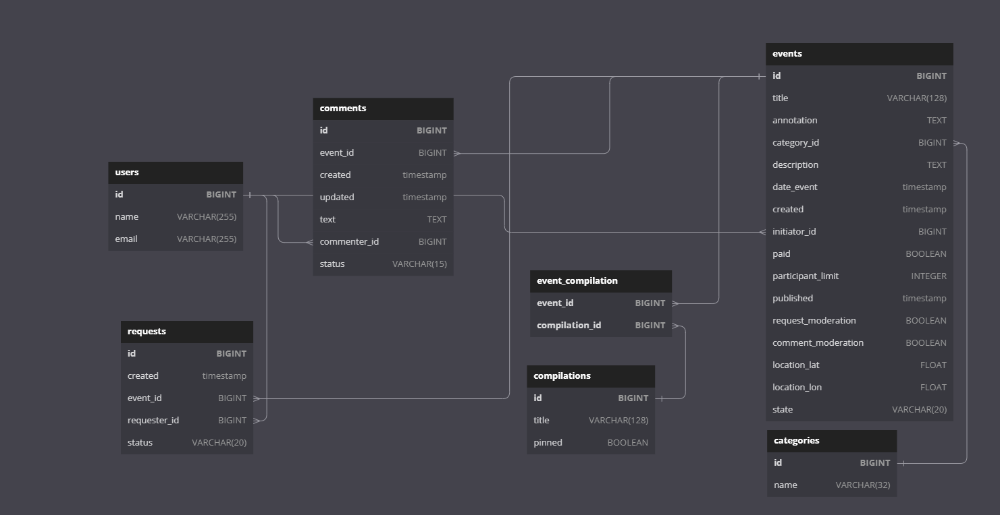
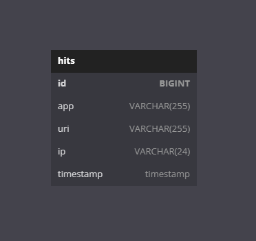

# Explore With Me - Дипломный проект

Explore With Me - web-приложение для сервиса социальных событий.

Вы можете создавать различные события - от похода в кино - до прогулок в лесу и скейтбординга!

Находите полезные и интересные подборки событий, которые вы хотели бы посетить,
подавайте заявки и одобряйте заявки на участие в ваших событиях.

# Архитектура

Приложение построено с использованием микросервисной архитектуры.

Основные сервисы:

### ewm-main

___

Главный сервис приложения.

Бизнес-логика обработки запросов разделена на три раздела: <b>Public</b>, <b>Private</b>, <b>Admin</b>.

```
Public - набор публичных эндпоинтов, доступных без регистрации. 

Основные возможности: поиск и просмотр событий,
просмотр подборок событий с поиском по фильтрам.
```

```
Private - набор приватных эндпоинтов, доступных для зарегистрированных пользователей.

Основные возможности: создание, обновление собственных событий, 
создание заявок на участие в событиях других пользователей, утверждение и отклонение заявок на участие в 
своих событиях.
```

```
Admin - набор приватных эндпоинтов, доступных только для администраторов. 

Основные возможности: модерация событий, утверждение комментариев, запросов на участие,
удаление и создание подборок и категорий.
```

Каждый раздел приложения имеет стандартную трехуровневую архитектуру Spring приложения:

```
Controller -> Service -> Repository
```

#### Схема БД

____



### ewm-stats

___

Вторичный сервис для сбора статистики.

```
Главная задача сервиса - сбор информации о запросах к эндпоинтам основного сервиса, 
ведение статистики и подготовка выборки статистики запросов.
```

Приложение имеет стандартную трехуровневую архитектуру Spring приложения:

```
Controller -> Service -> Repository
```

#### Схема БД



[Pull request] Opened Develop PR link: https://github.com/Noire86/java-explore-with-me/pull/1

[Pull request] Opened Feature PR link: https://github.com/Noire86/java-explore-with-me/pull/2
